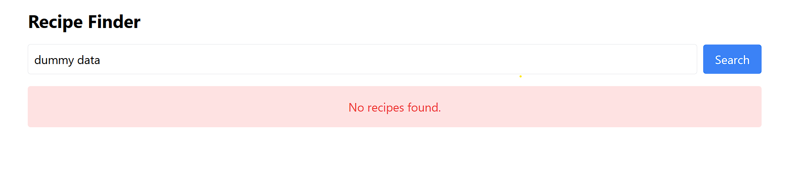
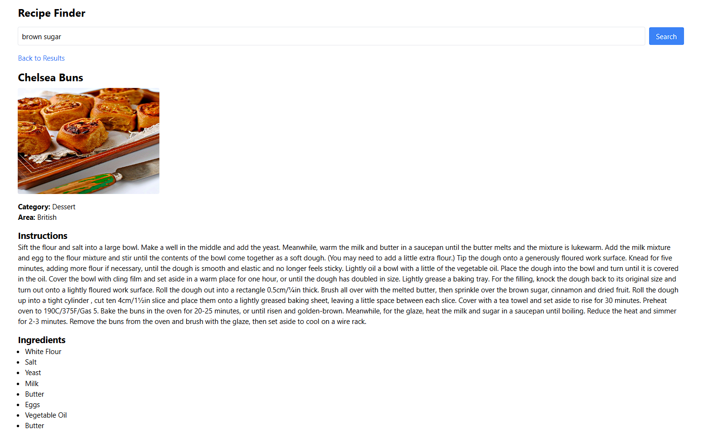

# Recipe Ideas Finder

A React-based recipe discovery application designed to help busy professionals quickly find meals they can cook based on ingredients they already have, their mood, or the time they have available.

This project was built with usability, responsiveness, and clean UI in mind.  
It fetches real-time recipe data from [TheMealDB API](https://www.themealdb.com) and makes cooking easier and more fun.

## Features

- **Ingredient-based Search**: Quickly find recipes by entering ingredients you have.
- **Cooking Time Filter**: Filter recipes based on the maximum time you want to spend cooking.
-**Mood / Cuisine Filter**: Pick cuisines (like Italian, Mexican, Indian) that match your current mood.
- **Recipe Details**: View detailed information about a selected recipe.
- **Responsive Design**: The app works on both desktop and mobile devices.
- **Error Handling**: Gracefully handles errors, displaying messages when no results are found or when the API fails.


## Technologies Used

- **React**: A JavaScript library for building user interfaces.
- **Axios**: A promise-based HTTP client for making API requests.
- **Tailwind CSS**: A utility-first CSS framework for building modern UIs.
- **TheMealDB API**: A public API used to fetch recipe data.

## Preview 

### Home Screen


### Recipe Search Error


### Recipe Search


### Recipe Details



## Getting Started

To get a local copy of the project up and running, follow these steps:

### Prerequisites

Make sure you have [Node.js](https://nodejs.org/) installed on your machine.

### Installation

1. Clone the repository to your local machine:
    ```bash
    git clone https://github.com/pratibha-singh13/Recipe-Ideas-Finder.git
    ```

2. Navigate to the project folder:
    ```bash
    cd recipe-ideas-finder
    ```

3. Install the dependencies:
    ```bash
    npm install
    ```

4. Run the app locally:
    ```bash
    npm run dev
    ```


