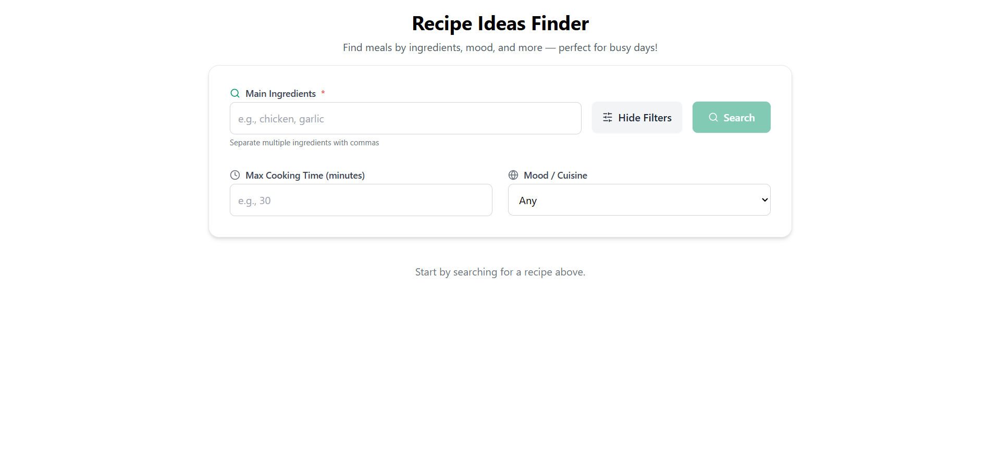
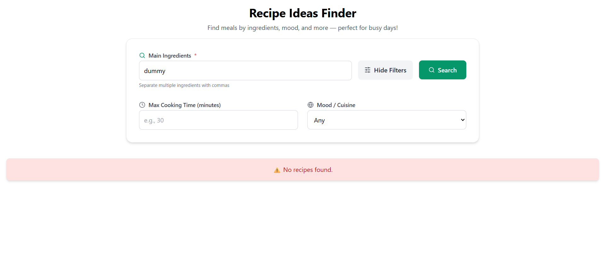
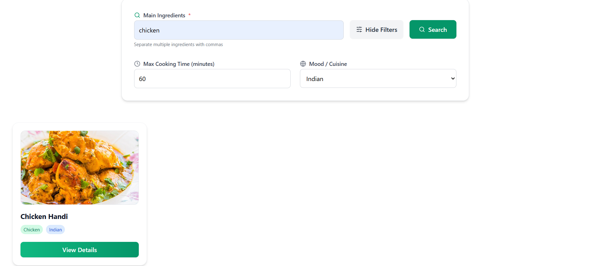
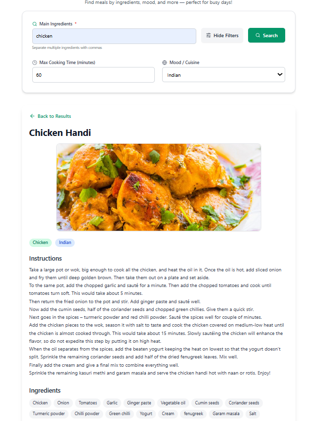

# Recipe Finder

A simple React-based application that allows users to search for recipes based on the ingredients they have and the time they have available for cooking. The app fetches data from [TheMealDB API](https://www.themealdb.com/api/json/v1/1/filter.php?i={ingredient}) and provides a clean, user-friendly interface to filter and discover meal ideas.

## Features

- **Ingredient-based Search**: Search for recipes by entering ingredients you have on hand.
- **Cooking Time Filter**: Filter recipes based on the maximum time you want to spend cooking.
- **Responsive Design**: The app works on both desktop and mobile devices.
- **Error Handling**: Gracefully handles errors, displaying messages when no results are found or when the API fails.
- **Recipe Details**: View detailed information about a selected recipe.

## Technologies Used

- **React**: A JavaScript library for building user interfaces.
- **Axios**: A promise-based HTTP client for making API requests.
- **Tailwind CSS**: A utility-first CSS framework for building modern UIs.
- **TheMealDB API**: A public API used to fetch recipe data.

## Preview 

### Home Screen


### Recipe Search Error


### Recipe Search


### Recipe Details



## Getting Started

To get a local copy of the project up and running, follow these steps:

### Prerequisites

Make sure you have [Node.js](https://nodejs.org/) installed on your machine.

### Installation

1. Clone the repository to your local machine:
    ```bash
    git clone https://github.com/your-username/recipe-finder.git
    ```

2. Navigate to the project folder:
    ```bash
    cd recipe-finder
    ```

3. Install the dependencies:
    ```bash
    npm install
    ```

4. Run the app locally:
    ```bash
    npm start
    ```


